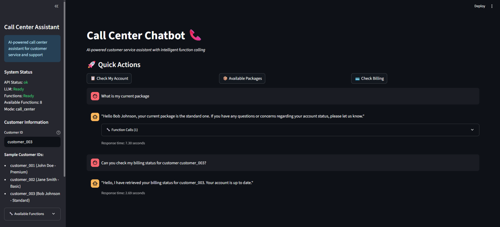
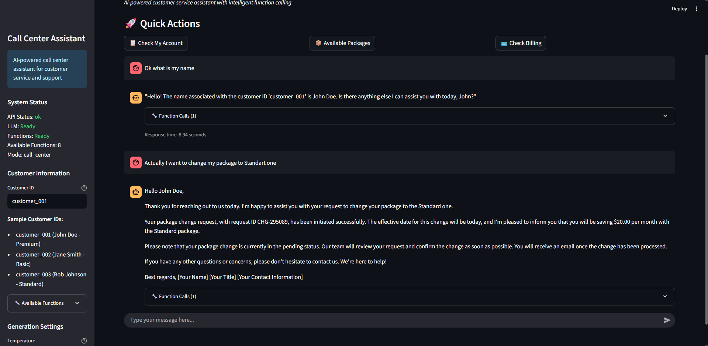
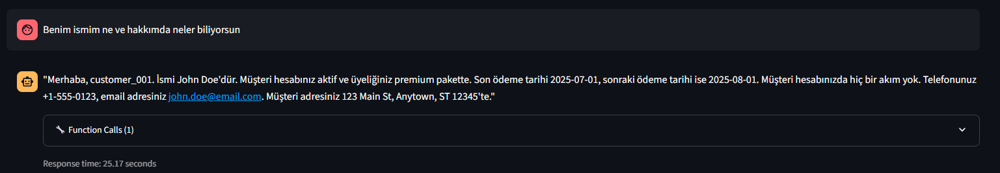

# Call Center Chatbot

An AI-powered call center assistant that uses function calling to handle customer service operations. This project provides intelligent customer support with automated functions for account management, billing, package changes, and technical support.

## Features

- **Intelligent Function Calling**: Automatically executes customer service functions based on conversation context
- **Customer Account Management**: Access customer information, billing status, and usage data
- **Package Management**: Show available packages, get details, and initiate package changes
- **Payment Processing**: Handle payment transactions and billing inquiries
- **Support Ticket Creation**: Generate support tickets for complex issues
- **Local LLM Integration**: Uses open-source language models for natural conversation
- **Web Interface**: Interactive Streamlit-based chat interface
- **FastAPI Backend**: Robust API for processing requests and managing functions

## Project Structure

```
.
├── src/
│   ├── functions/           # Call center function implementations
│   │   ├── call_center_functions.py  # Mock customer service functions
│   │   └── function_caller.py        # Function parsing and execution
│   ├── models/              # LLM integration
│   │   ├── call_center_llm.py        # Call center-specific LLM manager
│   ├── api/                 # FastAPI backend
│   │   ├── call_center_api.py        # Call center API endpoints
│   └── utils/               # Helper functions and configuration
│       └── config.py
├── webapp/                  # Streamlit web applications
│   ├── call_center_app.py   # Call center chat interface
├── run.py                   # To run project easily
├── requirements.txt         # Project dependencies
└── README.md               # Project documentation
```

## Available Functions

The call center chatbot can execute the following functions:

1. **get_customer_info(customer_id)** - Retrieve customer account information
2. **get_available_packages()** - Show all available service packages
3. **get_package_details(package_name)** - Get detailed information about a specific package
4. **initiate_package_change(customer_id, new_package, effective_date)** - Change customer's service package
5. **check_billing_status(customer_id)** - Check billing and payment information
6. **process_payment(customer_id, amount, payment_method)** - Process customer payments
7. **get_usage_summary(customer_id, period)** - Get usage statistics for a customer
8. **create_support_ticket(customer_id, issue_type, description, priority)** - Create support tickets

## Environment Variables 

```bash
# API Settings
API_HOST=0.0.0.0
API_PORT=8000

# Web App Settings
WEBAPP_HOST=0.0.0.0
WEBAPP_PORT=8501

# LLM Model Settings
LLM_MODEL=mistralai/Mistral-7B-Instruct-v0.3

# Hugging Face Settings
HUGGINGFACE_TOKEN=your_huggingface_token_here

# NGROK Settings (optional, for public access)
NGROK_AUTHTOKEN=your_ngrok_token_here
```

## Local Setup

1. Clone this repository:
```bash
git clone [repository-url]
cd call-center-chatbot
```

2. Create a virtual environment and activate it:
```bash
python -m venv venv
source venv/bin/activate  # On Windows: venv\Scripts\activate
```

3. Install dependencies:
```bash
pip install -r requirements.txt
```

4. Set up environment variables (create a `.env` file with the variables above)

5. Start the call center API:
```bash
python -m src.api.call_center_api
```

6. Launch the Streamlit web interface:
```bash
streamlit run webapp/call_center_app.py
```

## Usage

### Web Interface

1. Open the web interface at http://localhost:8501
2. Enter a customer ID (e.g., `customer_001`) for personalized assistance
3. Use quick action buttons or type natural language requests
4. The assistant will automatically call appropriate functions based on your request

### Sample Interactions

- **"Check my account information for customer_001"** → Calls `get_customer_info()`
- **"What packages do you have available?"** → Calls `get_available_packages()`
- **"I want to upgrade to the premium package"** → Calls `initiate_package_change()`
- **"What's my current billing status?"** → Calls `check_billing_status()`

### Test Customer Data

The system includes sample customer data:

- **customer_001** (John Doe): Premium plan, active account, no outstanding balance
- **customer_002** (Jane Smith): Basic plan, active account, $25.99 outstanding
- **customer_003** (Bob Johnson): Standard plan, suspended account, $75.99 outstanding

## API Endpoints

- **Health Check**: `GET /health` - Check system status
- **Chat**: `POST /chat` - Send message to the chatbot
- **Functions**: `GET /functions` - List available functions
- **Direct Function Call**: `POST /function/call` - Execute a function directly
- **API Documentation**: `/docs` - Interactive API documentation

## Colab Setup

For running in Google Colab:

1. Upload the project to Colab
2. Install dependencies: `!pip install -r requirements.txt`
3. Set environment variables:
```python
import os
os.environ["HUGGINGFACE_TOKEN"] = "your_token"
os.environ["NGROK_AUTHTOKEN"] = "your_ngrok_token"  # optional
```
4. Run the API: `!python -m src.api.call_center_api`

## Customization

- **Add New Functions**: Implement new functions in `src/functions/call_center_functions.py`
- **Modify Customer Data**: Update the `MOCK_CUSTOMERS` dictionary
- **Change LLM Model**: Update the `LLM_MODEL` environment variable
- **Customize UI**: Modify the Streamlit interface in `webapp/call_center_app.py`
- **Adjust Function Parsing**: Update patterns in `src/functions/function_caller.py`

## Screenshots

### Call Center Interface

The following screenshots demonstrate the call center chatbot interface in action:

#### Example 1


#### Example 2


#### Example 3



These screenshots show the interactive web interface where customers can chat with the AI assistant, and the system automatically executes relevant functions based on customer requests.

# TODO LIST

- Improve functions and promping for better execution
- Add TTS and STT for better user experience
- Turkish support for usage (Currently responding with same as prompt's language but not good as in English. Using LLM's fine-tuned in Turkish would fix this)
- RAG implementation with real data if necessary 
- Improve Chain-Of-Thought process